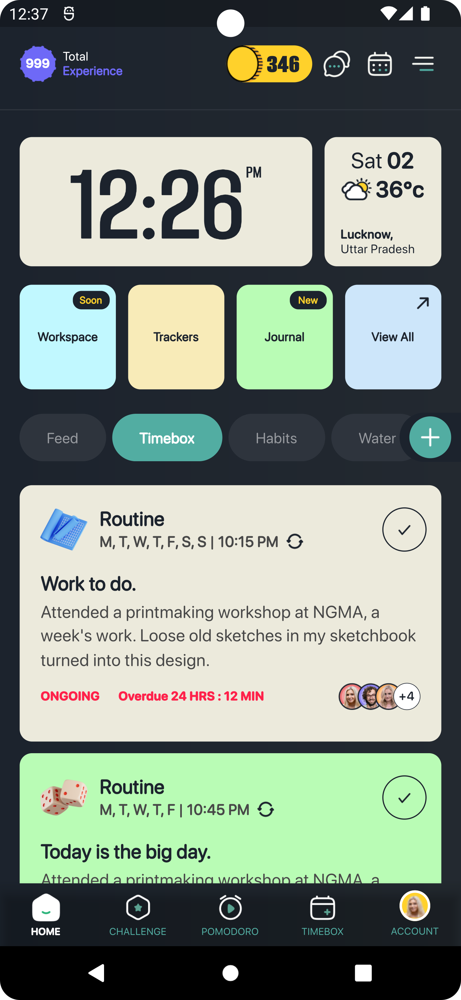
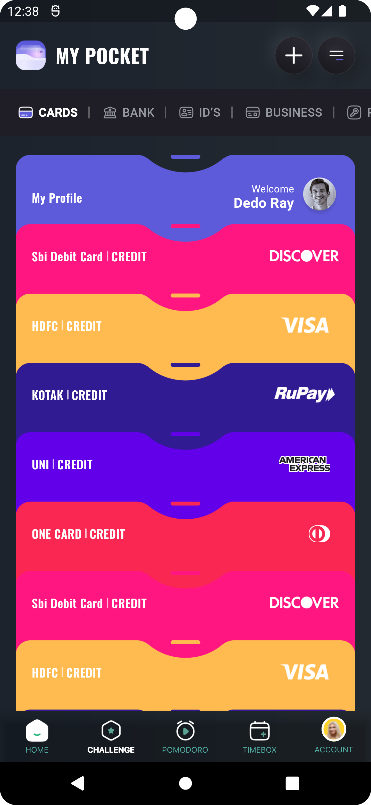
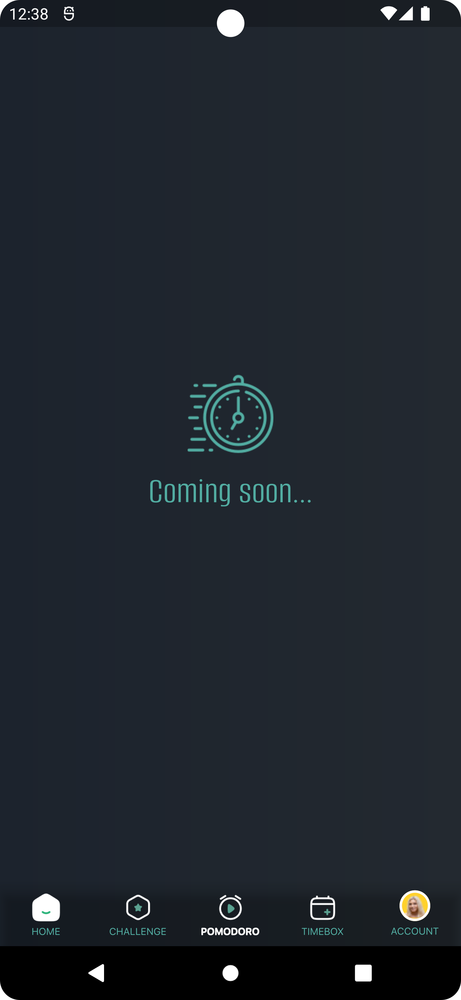

# rahil_shaikh
<html>
    <h1>Demo of Deep-linking</h1>
    

        This is simple <b>wallet app UI with deep-linking</b> integration.
         I build this project with GetX state management.
         I'll write the clean and clear code which help you to understand my development skill.
    

    

        
        
        
    

    
Developer : <b><i>Rahil Shaikh</i></b>

    
Email : <b><i>rahils416@gmail.com</i></b>

</html>