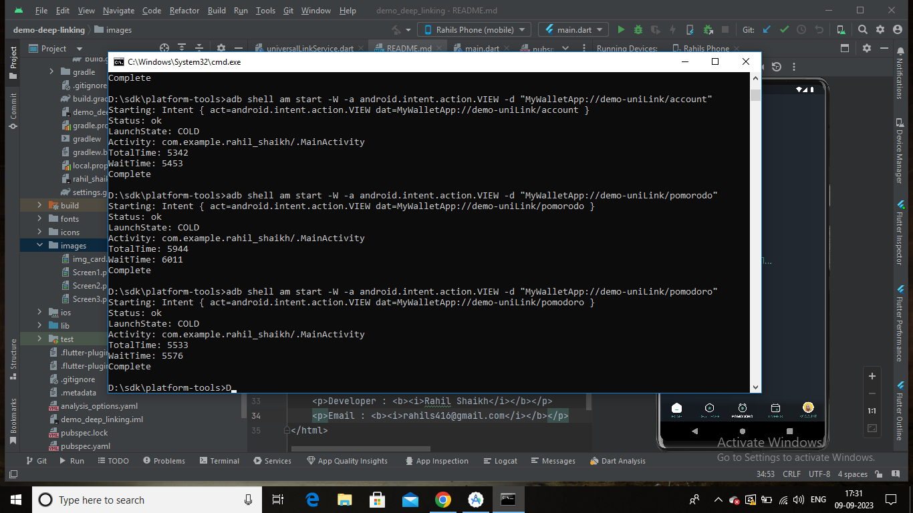

## Rahil_Shaik

<h1>Demo of Deep-linking</h1> 


<p>
This is simple wallet app UI with deep-linking integration.
I build this project with GetX state management.
I'll write the clean and clear code which help you to understand my development skill.
</p>

In this code i used <a href="https://pub.dev/packages/uni_links">uni_link</a> flutter package. Only the android side integration is done in this code.
to check code simply install the app in your emulator or physical device.
if you check this in emulator follow the below steps to check uni_link functionality.
&nbsp;
1) Open cmd in your system and go to the /platform-tools/ path of your sdk file.
2) run => ```adb shell am start -W -a android.intent.action.VIEW -d "MyWalletApp://demo-uniLink/home"```

 &nbsp;
 For different screen, change the screen name in command prompt
 &nbsp;
- For Home screen -> ```MyWalletApp://demo-uniLink/home```
- For Challenges screen -> ```MyWalletApp://demo-uniLink/challenge```
- For Pomodoro screen -> ```MyWalletApp://demo-uniLink/pomodoro```
- For TimeBox screen -> ```MyWalletApp://demo-uniLink/timeBox```
- For Account screen -> ```MyWalletApp://demo-uniLink/account```

&nbsp;
  <div style="display: flex; flex-direction: row;">
         &nbsp;
         &nbsp;
         &nbsp;
    </div>
&nbsp; 

- ## CMD example
<div>
    
</div>
&nbsp;
&nbsp;

> Developer : ```Rahil Shaikh```
> Email : ```rahils416@gmail.com```

   
